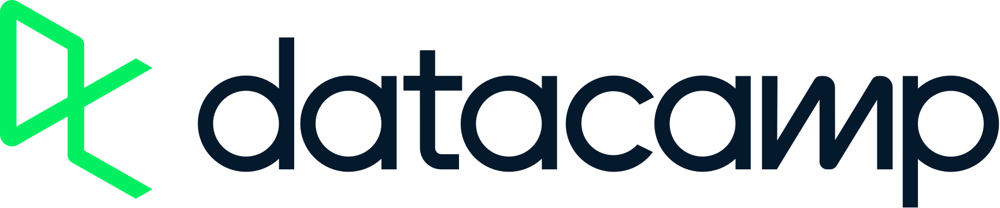

# DataCamp Study Archive
 

- 📚 Using the DataCamp platform for studying various Data-related topics, 
- 🎯 The repository aims to store studies on the subjects learned.
- 🔍 Machine Learning, Artificial Intelligence, Data Engineering, Data Analysis, Cloud Computing, IaC
- 📑 Incorporating class slides into the repository for future reference.

